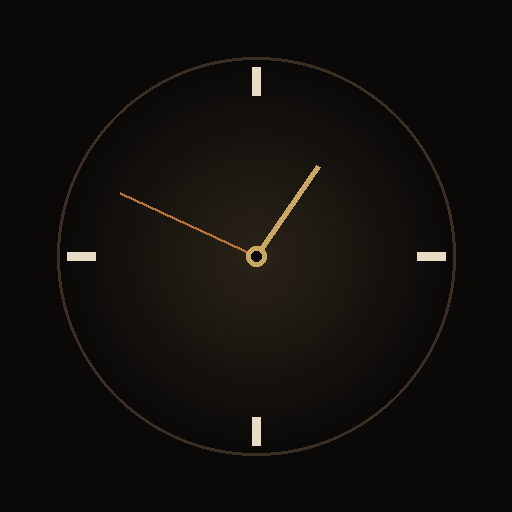

# TIMELAB Atelier

Full CRM para arbitraje de relojes de segunda mano. PWA mobile-first que vive en GitHub Pages y se sincroniza con tu Google Sheet.

<p align="center">
  
</p>

## Qué hace

- **Stock + pipeline de ventas**: comprado → publicado → vendido → (opcional) devuelto
- **Fotos** sincronizadas a Google Drive (visibles desde cualquier dispositivo)
- **Clientes** con LTV, histórico, log de interacciones
- **Oportunidades** con scoring automático GO/MAYBE/PASS
- **Comparables** de precios reales por modelo
- **Predicción** de tiempo hasta venta basada en histórico
- **Gastos generales** trimestrales
- **Informe trimestral en PDF** imprimible
- **Cálculo REBU correcto** (IVA sólo sobre margen)
- **Sincronización automática** con tu Google Sheet (3s después de cada cambio)

## Setup completo — 20 minutos

Necesitas una cuenta de Google y una cuenta de GitHub. Sigue estos pasos en orden.

### Parte A — Google Sheet + Apps Script (10 min)

1. **Crea un Google Sheet nuevo**. El nombre es libre, ej. `TIMELAB Database`.
2. Dentro del Sheet, ve a **Extensiones → Apps Script**. Se abre el editor.
3. **Borra todo el contenido** de `Code.gs` y pega el contenido de `apps-script/Code.gs` de este repo.
4. En la línea 13, **cambia el token**:
   ```js
   const TOKEN = "CAMBIA_ESTO_POR_UN_TOKEN_LARGO_Y_ALEATORIO_abc123xyz";
   ```
   Pon una cadena larga y aleatoria (ej. 32 caracteres). **Guárdala, la vas a necesitar más tarde.**
5. Guarda (icono 💾 o Ctrl+S).
6. En el dropdown de funciones (arriba), selecciona `setup` → pulsa **Ejecutar**. Google te pedirá permisos: acepta. Esto crea las hojas necesarias y la carpeta `TIMELAB-Fotos` en tu Drive.
7. **Despliega como web app**:
   - Pulsa **Implementar** (esquina superior derecha) → **Nueva implementación**
   - Tipo: **Aplicación web**
   - Ejecutar como: **Yo**
   - Acceso: **Cualquier usuario** (sí, aunque suene feo — está protegido por el token)
   - Pulsa **Implementar**
   - **Copia la URL** que te da (termina en `/exec`). La guardas junto al token.

### Parte B — GitHub Pages (5 min)

1. Crea un **nuevo repositorio** en GitHub (puede ser público o privado). Nombre sugerido: `timelab-atelier`.
2. Descarga este proyecto como ZIP o haz fork.
3. En tu máquina:
   ```bash
   cd timelab-atelier
   git init
   git remote add origin https://github.com/TU_USUARIO/timelab-atelier.git
   git add .
   git commit -m "Initial commit"
   git branch -M main
   git push -u origin main
   ```
4. En GitHub, ve a **Settings → Pages**. En "Source" selecciona **GitHub Actions**.
5. Espera 1-2 minutos. La pestaña "Actions" te mostrará el progreso. Cuando acabe, tu app está en:
   ```
   https://TU_USUARIO.github.io/timelab-atelier/
   ```

### Parte C — Conectar CRM y Sheet (2 min)

1. Abre la URL de tu CRM en el móvil.
2. Ve a **Ajustes → Sincronización nube**.
3. Pega:
   - **URL del Apps Script**: la URL `/exec` de Parte A paso 7
   - **Token secreto**: el que definiste en Parte A paso 4
4. Pulsa **Probar**. Debería salir `✓ Conexión OK`.
5. Pulsa **Push local → nube** para subir por primera vez tus datos del 2T a la Sheet.
6. A partir de ahora, cada cambio se sincroniza automáticamente 3 segundos después.

### Parte D — Instalar como app (opcional, 1 min)

**iPhone/iPad:**
- Abre la URL en Safari
- Botón Compartir → **Añadir a pantalla de inicio**

**Android:**
- Abre la URL en Chrome
- Menú → **Instalar app**

Ahora la tienes como una app nativa, con icono y sin barra de navegador.

## Cómo funciona la sincronización

```
┌─────────────┐     3s después      ┌──────────────┐       ┌───────────────┐
│   CRM en    │ ─────── push ─────→ │ Apps Script  │ ────→ │ Google Sheet  │
│ tu móvil    │                     │   webhook    │       │  (tabular DB) │
└─────────────┘ ←────── pull ─────── └──────────────┘ ←──── └───────────────┘
      │                                     │
      │         foto nueva                  │  base64 decode
      └─────────────────────────────────────┴──→ Google Drive / TIMELAB-Fotos/
```

- **Push local → nube**: sucede automáticamente 3 segundos después del último cambio. Reemplaza el contenido entero de las hojas con el estado actual del CRM.
- **Pull nube → local**: sucede al abrir la app. Si estabas editando desde otro dispositivo, se recupera el estado más reciente.
- **Fotos**: se suben a Drive en segundo plano (fire-and-forget). La miniatura muestra 🟡 spinner mientras sube, 🟢 nube cuando está sincronizada. Si la subida falla (offline, cuota...), se reintenta en la siguiente sincronización.
- **Offline-first**: todo sigue funcionando sin conexión gracias a `localStorage`. La sync se reanuda al recuperar red.

## Arquitectura

```
timelab-atelier/
├── apps-script/Code.gs        ← Backend en Google (Sheet + Drive)
├── public/
│   ├── manifest.webmanifest   ← PWA manifest
│   ├── icon.svg, icon-192.png, icon-512.png
├── src/
│   ├── main.jsx               ← React entry
│   ├── App.jsx                ← El CRM completo (~3000 líneas)
│   ├── storage.js             ← Capa de storage + sync
│   └── index.css              ← Tailwind
├── .github/workflows/deploy.yml ← CI que publica a Pages en cada push
├── vite.config.js
├── package.json
└── README.md (este archivo)
```

## Desarrollo local

```bash
npm install
npm run dev       # abre en http://localhost:5173
npm run build     # genera dist/ listo para desplegar
```

## FAQ

**¿Puedo editar directamente en la Sheet?**
Sí, pero con cuidado: el próximo `push` del CRM sobrescribirá todo. Para cambios manuales, hazlo, luego en el CRM pulsa **Pull nube → local** para importarlos.

**¿Qué pasa si dos dispositivos editan a la vez?**
El último en sincronizar gana (last-write-wins). Para uso individual desde móvil/desktop alternando no debería ser problema.

**¿Cómo cambio el token?**
Cambia la constante en `Code.gs`, guarda, **despliega una nueva versión** (Implementar → Gestionar implementaciones → icono lápiz → Nueva versión), y actualiza el token en Ajustes del CRM.

**¿Las fotos se ven desde el ordenador si las subí del móvil?**
Sí, una vez sincronizadas con Drive. La miniatura queda con el icono verde ☁️ cuando está lista.

**¿Es gratis?**
Sí. GitHub Pages es gratis para repos públicos. Apps Script permite 20.000 ejecuciones/día gratis. Drive te da 15GB gratis con tu cuenta de Gmail. Para el volumen de TIMELAB (cientos de ops/trimestre) es holgado.

**¿Puedo hacerlo privado?**
El repo de GitHub puede ser privado pero entonces Pages requiere plan GitHub Pro. La Sheet la tienes tú sola (el Apps Script se ejecuta como tú). El CRM está en una URL pública pero ofuscada (tu usuario-repo.github.io) y sin el token el Apps Script rechaza cualquier petición.

---

**TIMELAB Atelier v3.1** · Built con React + Vite + Tailwind + Apps Script
